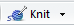

This document shows you how to analyze your Nordea bank transaction data, by categorizing transactions based on the recipient, and then drawing summarizing visualizations on your income/expenses patterns.

##Requirements
* you have one or more Nordea accounts
* you have R & RStudio, to run R code and generate the resulting RMarkdown document (both free, [R](https://cran.r-project.org/bin/) and [RStudio](https://www.rstudio.com/products/rstudio/download/))

##Setup

Download the transaction files from Nordea. You have to log in to your banking interface, go to "Accounts" ("Tilit"), select and account and go to "Transactions" ("Tapahtumaluettelo"). There, you can select the time period you want, for example the whole 2016 year. Then just download the files for all accounts you want to analyze (you can also exclude accounts later in the analysis). Save all the .txt files in a folder called "data", so that "data" is a subfolder to where this script is located. So let's say this script is in a folder called "Bank_analysis", then store the .txt files in "Bank_analysis/data".

The examples below plot some figures from the supplied example data. To run the analysis in your Rstudio console, press the button that says "Knit" and looks like this:


##Define used Nordea data
Okay, so first we start by listing your bank transaction files. They should be in the "data" folder, as described above. You can use str_exclude to exclude any accounts you don't want to analyze after all.

```r
#list all files in folder
#if your subfolder isn't called "data", you can change the name here
files <- list.files("./data")
#use string selector if you want to exclude account numbers
#will exclude all files that have exclude string in the name
#if you don't want to exclude anything, just let the str_exclude be empty
str_exclude <- c("") #or for example c("FI91") to exclude all accounts that include FI91 in their number
str_exclude <- ifelse(str_exclude=="","NA",str_exclude)
files <- files[regexpr(str_exclude,files)==-1]


#readr package has a good function for loading data in
library(readr)
#this defines the column names for loaded data
colnames <- c(
  "Book date",
  "Value date",
  "Payment date",
  "Amount",
  "Recipient",
  "To account",
  "BIC",
  "Event type",
  "Ref",
  "Payer ref",
  "Message",
  "Card number",
  "Receipt",
  "Empty"
  )
#this defines the incoming column types, because read_delim can otherwise sometimes fail
coltypes="DDDdcccccccccc"

#this is the function for loading data in
read_bank_data <-function(file,fromAccount){
  #skip first three lines because Nordea format sucks
  dat <- read_delim(file,delim = "\t",skip=3,
    locale = locale(decimal_mark = ",",
    date_format = "%d.%m.%Y"),col_names=colnames,col_types = coltypes)
  #remove the empty column
  dat$Empty <- NULL
  #store which of your accounts was used for the transaction
  dat$fromAccount <- fromAccount
  return(dat)
}
```

Now, because it's quite hard to remember account numbers, you can save more descriptive names for them in this step.

###Define account names

```r
#define the account numbers here, so names can be assigned
account_numbers <- c("FI0613505000120405","FI9113093500144118","FI1217713500024350","FI4713093500144134")
account_names <-c("Checking account","Emergency fund","Grants","Savings") 
#with this, you can call account_labeller[account_number] and get the name that you have defined
account_labeller <- setNames(account_names,account_numbers)
```

Having defined how we want to load the data in, now we just use the previously defined function and process each file.

```r
dat <- NULL
for(f in files){
  #get the defined account name
  accname <- account_labeller[strsplit(f,"_")[[1]][2]]
  #pull data into data frame
  fname <- paste0("./data/",f)
  dat <- rbind(dat,read_bank_data(fname,accname))
}
```
##Define categories for payments
Here this command shows you a list of all your unique recipients for the time periods. This list helps you with defining your categories. The write command saves the list automatically to a file called *"recipients.txt"*.


```r
unique(dat$Recipient)
```

```
##  [1] "FAMILY_1"                       "Fazer Food Services Oy"        
##  [3] "Punavuoren Ahven"               "T mi Dimrat"                   
##  [5] "ALEPA CALONIUKSENKATU"          "Zeberas Oy"                    
##  [7] "VFI"                            "HSL Kamppi"                    
##  [9] "PAYPAL *PAY.GOV U.S"            "Nordea Pankki Suomi Oyj"       
## [11] "Tele Finland/TeliaSonera Finla" "PAYPAL *SPOTIFY"               
## [13] "XYZ CO"                         "MY ACC"                        
## [15] "Cafe Esplanad"                  "NORDNET BANK AB"               
## [17] "Ristorante Papa Albert"         "Central"                       
## [19] "UniSport   Töölö kassa 37"      "R HKI KAMPIN METRO"            
## [21] "Omatili"                        "Satkar Oy"                     
## [23] "ALEPA MUNKKINIEMEN PUI"         "Apteekki Toolo"                
## [25] "R ESPOO OTANIEMI"               "Intersport Mikonkatu Hels"     
## [27] "CLAS OHLSON KAM"                "ESPRESSOHOUSE KAMPPI"          
## [29] "HSL Kampin terminaali"          "Boulderkeskus Isatis"          
## [31] "NORDEA RAHOITUS SUOMI OY"       "Haaga Instituutti Säätiö"      
## [33] "Alko Helsinki Lauttasaari"      "MCDONALDS PACIUKSENK."         
## [35] "K SUPERMARKET KAMPPI"           "KUNTOKUMPPANIT"                
## [37] "Harman Foods Oy"                "Katrina s Cafe   Cater"        
## [39] "Siwa Mechelinink 19 43887"      "Koulutuskeskus Unika H"        
## [41] "RAVINTOLA FACTORY KAMP"         "Antell Ravintolat Oy Aalt"     
## [43] "CAFE TORI"                      "GREEN CAB"                     
## [45] "Starbucks  40945"               "MAUERMUSEUM AM CC"             
## [47] "HSL Lentoasema"                 "Mäkelänrinteen Uintikesku"     
## [49] "LEONARDO"                       "ABC PERSON"                    
## [51] "Pistrina Oy"                    NA                              
## [53] "LA CANAULIERE"                  "ELITE PALACE HOTEL"            
## [55] "VIGARDA VASAGATAN 44"           "5135 STARBUCKS"                
## [57] "CAFFE MEZZO"                    "HENNES   MAURITZ SE014"        
## [59] "FLIPPIN BURGERS"                "RESTAURANG DRAMA"              
## [61] "BIERHAUS"                       "Helsingin Kirja  ja le"        
## [63] "Stockmann Helsinki"             "ALEPA OTANIEMI"                
## [65] "Meilahden Liikuntakesk"         "AKATEEMINEN HELSINKI"          
## [67] "Los Bastardos Oy"               "POCKET SHOP RAUTATIEAS"        
## [69] "iZ *RIVA Clothing"              "Avecra Oy Baguette   C"        
## [71] "AS OY"                          "iZ *Karuda Hyvinvo"            
## [73] "BASE CAMP"                      "Ravintola Kuukuu"              
## [75] "Alko Helsinki Arkadia"          "FAMILY_2"                      
## [77] "Suomalainen Kirjakaupp"         "PICNIC ASEMATUN"               
## [79] "PAYPAL *STEAM GAMES"            "Tiketti.fi"                    
## [81] "INSURANCE_1"                    "NORDEA PANKKI"                 
## [83] "GRANT_1"
```

```r
write.table(unique(dat$Recipient),"recipients.txt",sep=",",row.names = F,col.names = F)
```

In this block you can define your own categories, and what to look for when replacing them. You can do the list easily by copypasting the *"recipients.txt"* in the code below, and the just defining your own categories. Categories are key/value pairs, so that the first value is the key (what to look for in the recipient field, case-insensitive), and the second is the category for that income/expense. A good tip is to generalize, by for example defining _"restaurant"="restaurants"_ and _"ravintola"="restaurants"_. This means that anything that contains the word _"restaurant"_ or _"ravintola"_ will be categorized as a restaurant. Similarly, you can define all _"alepa"_ locations as grocery stores with one rule. Check the code below for examples. Remember to have the commas at the end of each line (except the last)!


```r
grep_replacements <- c(
  "alepa"="food",
  "HSL"="public transport",
  "Cafe"="coffee",
  "STARBUCKS"="coffee",
  "Wolt Enterprises"="restaurants",
  "ravintola"="restaurants",
  "restaurant"="restaurants",
  "Spotify"="entertainment",
  "Nordea Pankki Suomi Oyj"="banking",
  "XYZ CO"="work",
  "NORDEA RAHOITUS SUOMI OY"="credit card",
  "MY ACC"="internal",
  "ABC PERSON"="family",
  "VR kondukt"="public transport",
  "Bar "="restaurants",
  "apteekki"="pharmacy",
  "Fazer Food Services Oy"="lunch",
  "Viestintävirasto"="entertainment",
  "Tele Finland/TeliaSonera"="phone",
  "HSL HELSINGIN SEUDUN LIIKENNE"="public transport",
  "San Pedro Tex Mex Kamp"="restaurants",
  "GRANT_1"="grants",
  "STEAM GAMES"="entertainment",
  "K market"="food",
  "Alko"="food",
  "MobilePay"="friends",
  "LUFTHANSA"="travel",
  "Apteekki Express"="pharmacy",
  "Caffe"="coffee",
  "NORWEGIAN"="travel",
  "NORDNET"="investing",
  "LIDL"="food",
  "STARBUCKS"="coffee",
  "Postbank"="banking",
  "Yliopistoliikunnan"="sport",
  "PAYPAL *HUMBLEBUNDL"="entertainment",
  "YA Toolo"="pharmacy",
  "Erottaja Night"="restaurants",
  "MCDONALDS"="restaurants",
  "Omatili"="monthly common",
  "UniSport"="sport",
  "PRISMA"="food",
  "ESPRESSO"="coffee",
  "fitnesstukku"="sport",
  "SHANGHAI COWBOY HELSIN"="restaurants",
  "Punavuoren Ahven"="restaurants",
  "Ristorante"="restaurants",
  "Satkar Oy"="food",
  "Intersport"="sport",
  "Boulderkeskus"="sport",
  "K SUPERMARKET"="food",
  "Siwa"="food",
  "museum"="entertainment",
  "Mäkelänrinteen Uintikesku"="sport",
  "MAURITZ"="clothing",
  "RESTAURANG"="restaurants",
  "BIER"="restaurants",
  "Meilahden Liikuntakesk"="sport",
  "AKATEEMINEN HELSINKI"="books",
  "POCKET SHOP RAUTATIEAS"="books",
  "Clothing"="clothing",
  "FAMILY"="family",
  "Suomalainen Kirjakaupp"="books",
  "MAURITZ"="shopping",
  "Stockmann"="shopping",
  "PICNIC ASEMATUN"="coffee",
  "Tiketti.fi"="entertainment",
  "ESPOON SUUNTA RY"="sport",
  "NORDEA"="banking",
  "INSURANCE_1"="insurance",
  "AS OY"="investing",
  "CLAS OHLSON"="shopping"

)
```
This piece of script shows you all the 1st level categories that you have defined:

```r
unique(grep_replacements)
```

```
##  [1] "food"             "public transport" "coffee"          
##  [4] "restaurants"      "entertainment"    "banking"         
##  [7] "work"             "credit card"      "internal"        
## [10] "family"           "pharmacy"         "lunch"           
## [13] "phone"            "grants"           "friends"         
## [16] "travel"           "investing"        "sport"           
## [19] "monthly common"   "clothing"         "books"           
## [22] "shopping"         "insurance"
```
Because the above lists quite many categories, I'll do 2nd level categories that are more general. These will be used later for plotting. Again, they are key/value pairs, so that the key is the 1st level category and the value is the 2nd level more general one. I'll also do a similar generalization from 2nd level into musts/wants, so it's easy to separate mandatory from discretionary spending. 

```r
#key= 1st level category
#value = 2nd level more general category
general_categories <- c(
  "banking"="bank & insurance",
  "books"="shopping",
  "clothing"="shopping",
  "coffee"="going out",
  "entertainment"="shopping",
  "food"="food",
  "insurance"="bank & insurance",
  "investing"="bank & insurance",
  "lunch"="food",
  "monthly common"="monthly common",
  "phone"="mandatory",
  "public transport"="public transport",
  "restaurants"="going out",
  "sport"="shopping",
  "travel"="travel"
)

#really just two categories: must vs want
#key = 2nd level category
#value = must / want
must_vs_want <- c(
  "bank & insurance"="must",
  "shopping"="want",
  "going out"="want",
  "food"="must",
  "monthly common"="must",
  "mandatory"="must",
  "public transport"="must",
  "travel"="want"
)
```

Now we set the categories based on the Recipient field. You could base them on any other field, too, but I've just used the Recipient field.

```r
dat$category <- dat$Recipient
for(x in 1:length(grep_replacements)){
  dat$category[grep(names(grep_replacements)[x],dat$category,ignore.case = T)] <- grep_replacements[x]}

#anything not in a defined category goes into category "Other"
dat$category <- sapply(1:length(dat$category),function(n) ifelse(dat$category[n] %in% grep_replacements,dat$category[n],"Other"))

#do the setting also for general categories
dat$general_category <- dat$category
for(x in 1:length(general_categories)){
  dat$general_category[grep(names(general_categories)[x],dat$general_category,ignore.case = T)] <- general_categories[x]}

#anything not in a defined category goes into category "other"
dat$general_category <- sapply(1:length(dat$general_category),function(n) ifelse(dat$general_category[n] %in% general_categories,dat$general_category[n],"other"))

#do the setting also for must_vs_wants
dat$must_vs_want <- dat$general_category
for(x in 1:length(must_vs_want)){
  dat$must_vs_want[grep(names(must_vs_want)[x],dat$must_vs_want,ignore.case = T)] <- must_vs_want[x]}

#anything not in a defined category goes into category "want"
dat$must_vs_want <- sapply(1:length(dat$must_vs_want),function(n) ifelse(dat$must_vs_want[n] %in% must_vs_want,dat$must_vs_want[n],"want"))

#reorder levels so that plot is more sensible
dat$must_vs_want <- factor(dat$must_vs_want, levels = c("want","must"))
```
Finally, let's print how many transactions got "other" as their category (i.e. weren't classified by any rule on the first level). If this is high, you might want to generate more rules. 

```r
table(dat$category=="Other",format(dat$"Payment date","%m"))
```

```
##        
##         10 11 12
##   FALSE 54 39 68
##   TRUE   7  8  9
```

```r
#You can also see the targets labeled "Other" below.
as.data.frame(unique(dat[dat$category=="Other",c("Recipient")]))
```

```
##                    Recipient
## 1                T mi Dimrat
## 2                        VFI
## 3        PAYPAL *PAY.GOV U.S
## 4                    Central
## 5         R HKI KAMPIN METRO
## 6           R ESPOO OTANIEMI
## 7   Haaga Instituutti Säätiö
## 8             KUNTOKUMPPANIT
## 9            Harman Foods Oy
## 10    Koulutuskeskus Unika H
## 11                 GREEN CAB
## 12 Mäkelänrinteen Uintikesku
## 13                  LEONARDO
## 14               Pistrina Oy
## 15                      <NA>
## 16             LA CANAULIERE
## 17        ELITE PALACE HOTEL
## 18      VIGARDA VASAGATAN 44
## 19           FLIPPIN BURGERS
## 20    Helsingin Kirja  ja le
## 21          Los Bastardos Oy
## 22    Avecra Oy Baguette   C
## 23        iZ *Karuda Hyvinvo
## 24                 BASE CAMP
```


Now we have created a data frame that holds one transaction per row, and we have added a column that notes the account the money came from. Let's try out some visualisations. Here's the payment amounts by time and account.


```r
dat_filtered <- melt(dat,id.vars=c("fromAccount","Payment date","Recipient","category","general_category","must_vs_want"),measure.vars=c("Amount"))
#ignore internal transfers
dat_filtered <- dat_filtered%>%filter(category!="internal")
ggplot(dat_filtered,aes(x=dat_filtered$`Payment date`,y=value,col=fromAccount))+geom_point()
```


If you have bought a house or such, the loan may appear in you bank statement. For a cash flow analysis, you might want to do that. This shows how to do that, even though for this test data set, nothing changes.

```r
#ignore outliers (defined as value<10k or value>10k)
dat_filtered <- arrange(dat_filtered,fromAccount)%>%filter(abs(value)<10000)
#is the same plot with test data
#ggplot(dat_filtered,aes(x=dat_filtered$`Payment date`,y=value,col=fromAccount))+geom_point()
```

That looks a bit better. Now we can go on with more analysis. For example, what are the most common transaction targets? I'll filter out targets that only appear a few times.

```r
temp2 <- dat %>% group_by(Recipient) %>% filter(n()>5)
ggplot(temp2,aes(x=reorder(Recipient, table(Recipient)[Recipient]),fill=fromAccount))+geom_bar()+coord_flip()
```


Suppose you want a graph about your balance for just one month. You can get it like this:

```r
which_month <- 10
df <- dat_filtered[,c("Payment date","value")]%>%mutate(day=format(dat_filtered$`Payment date`,"%d"))%>%mutate(day=as.numeric(day))%>%mutate(month=format(dat_filtered$`Payment date`,"%m"))%>%mutate(month=as.numeric(month))%>%filter(month==which_month)%>%group_by(day)
df <- summarise(group_by(df,day),"value"=sum(value))
ggplot(df,aes(x=day,y=cumsum(value)))+geom_line()
```


How much money are you spending, and how much money are you getting in for the year? Blue bars are income and red bars are expenses. The black point is the net income for each month.

```r
df <- dat_filtered[,c("Payment date","value")]%>%mutate(month=format(dat_filtered$`Payment date`,"%m"))%>%mutate(month=as.numeric(month))%>%group_by(month)%>%mutate(income=ifelse(value>0,TRUE,FALSE))
df <- summarise(group_by(df,month,income),"value"=sum(value))
ggplot(df,aes(x=month,y=value))+geom_bar(aes(fill=income),stat="identity")+
  geom_point(data=summarise(group_by(df,month),"value"=sum(value)))
```


How about cumulative income and expenses per month - is your lifestyle looking sustainable? The black points are monthly net income, the red line is a locally smoothed line.

```r
ggplot(data=summarise(group_by(df,month),"value"=sum(value)),aes(x=month,y=cumsum(value)))+geom_point()+geom_line(aes(group=1))+geom_smooth(aes(x=month,y=cumsum(value),col="red"),show.legend = F,se=F)
```


  
How are you spending money per category this year monthly? I'll filter out income, and only look at costs.

```r
temp3 <- dat_filtered %>% mutate(month=format(dat_filtered$`Payment date`,"%m"))%>%mutate(month=factor(month))%>%group_by(month)
#filter so only costs are displayed
temp3 <- temp3%>%mutate(value=-value)%>%filter(value>0)
ggplot(temp3,aes(x=month,y=value,fill=category))+geom_bar(stat = "identity")
```


As you see, this plot is pretty messy - I have too many categories for the plot to look nice. However, many categories are still nice to have in the data, just in case I want to look at expenses on a more granular level.

But for a nicer visualization, let's try the same graph with the 2nd level categories that are a little more aggregated:

```r
ggplot(temp3,aes(x=month,y=value,fill=general_category))+geom_bar(stat = "identity")+scale_fill_brewer(type="qual",palette="Set3")
```


Ok, this is already way clearer! A lot of stuff gets thrown into the "other" category, so in the future, I might consider splitting it up somehow.

Finally, I'll do the same graph with just must vs. want categorization. This is a *very* aggregated analysis already, basically useful for looking at whether expenses are changing because necessities are different, or because there's more discretionary spending.

```r
ggplot(arrange(temp3,must_vs_want),aes(x=month,y=value,fill=must_vs_want))+geom_bar(stat = "identity")
```


As for summaries, this gives you a nice PivotTable-style summary of expenses by category and month. I have used the *temp3* defined above, so that we only look at expenses.

```r
#summary for the 1st level categories
dcast(temp3,month~category,fun.aggregate = sum,value.var = "value")
```

```
##   month banking  books clothing coffee credit card entertainment  family
## 1    10    3.25   0.00     0.00  12.70       21.56          4.99    0.00
## 2    11    3.25   0.00     0.00  21.25      947.44         27.49 1493.87
## 3    12    3.25 107.25    30.16  30.46      165.76         44.78  784.92
##    food insurance investing lunch monthly common  Other pharmacy phone
## 1 50.85      0.00    303.30 91.25            631 138.34      2.5 44.44
## 2 20.21    256.52    300.00 67.20            631 111.54      0.0  0.00
## 3 32.94    769.54   2522.22 62.75            631 227.89      0.0 20.94
##   public transport restaurants shopping sport
## 1            142.9       34.10     7.99 73.65
## 2             20.0       11.30     0.00  0.00
## 3             30.0       37.66     8.90  4.50
```

```r
#summary for the 1st level categories
dcast(temp3,month~general_category,fun.aggregate = sum,value.var = "value")
```

```
##   month bank & insurance   food going out mandatory monthly common   other
## 1    10           306.55 142.10     46.80     44.44            631  162.40
## 2    11           559.77  87.41     32.55      0.00            631 2552.85
## 3    12          3295.01  95.69     68.12     20.94            631 1178.57
##   shopping
## 1   229.53
## 2    47.49
## 3   225.59
```

```r
#summary for the must_vs_want
dcast(temp3,month~must_vs_want,fun.aggregate = sum,value.var = "value")
```

```
##   month    want    must
## 1    10  438.73 1124.09
## 2    11 2632.89 1278.18
## 3    12 1472.28 4042.64
```

And that's a wrap, thanks for reading! These plots and summaries should enable you to analyze your own expenses quite nicely. If you want to know more, or something doesn't work, get in touch via [Twitter](https://twitter.com/tjpajala), for example.
